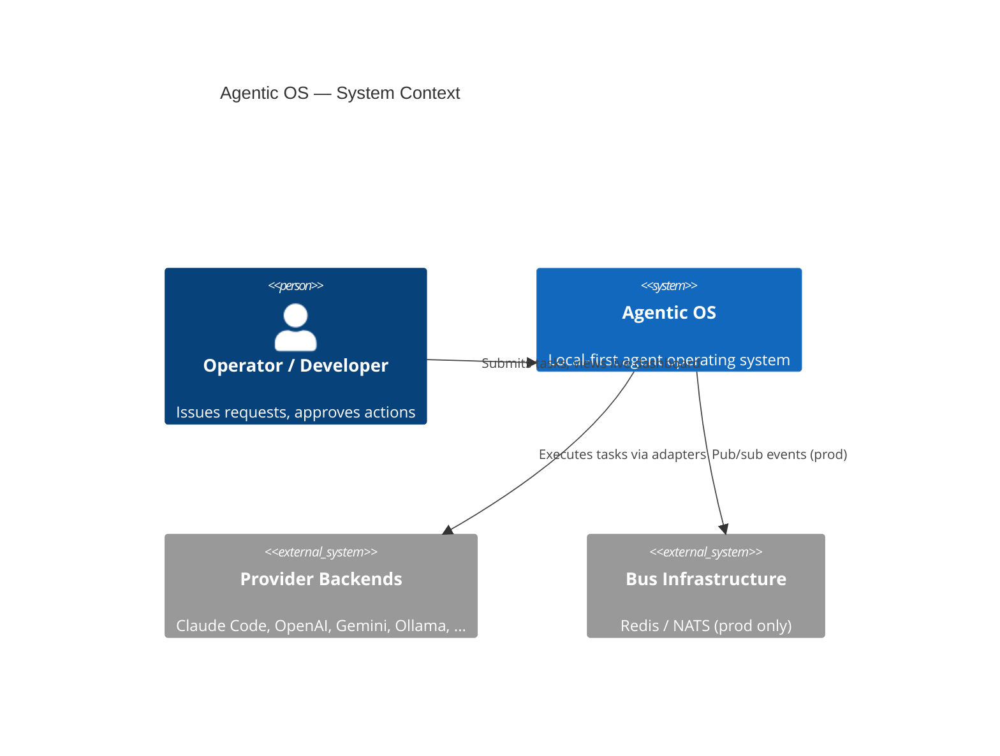
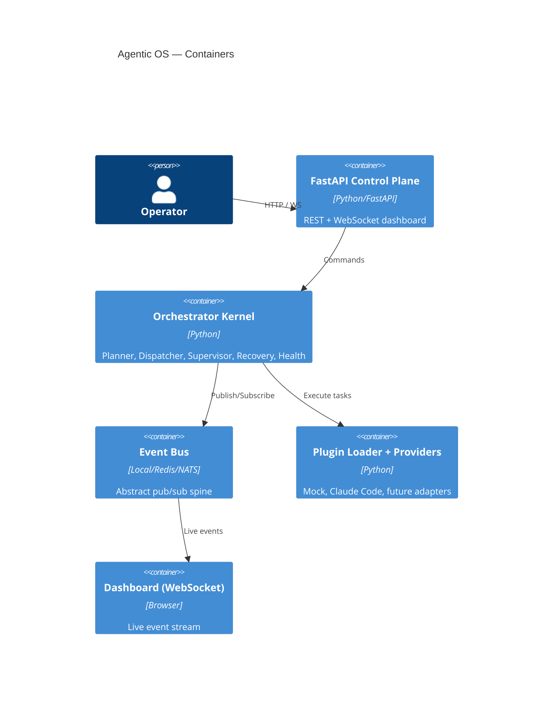

# C4 Architecture Diagrams

## Context (C4 Level 1)



## Container (C4 Level 2)



## Component (C4 Level 3 — Orchestrator)

```mermaid
C4Component
    title Orchestrator Kernel — Components
    Container_Boundary(core, "Core") {
        Component(planner, "Planner", "task.created -> task.planned")
        Component(dispatcher, "Task Dispatcher", "plans -> spawns agent -> runs provider")
        Component(supervisor, "Supervisor", "observes completion/failure")
        Component(health, "Health Monitor", "periodic liveness checks")
        Component(recovery, "Recovery Manager", "retry on failure (capped)")
    }
    Container(bus, "Event Bus")
    Container(reg, "AgentRegistry / ProviderRegistry")

    Rel(planner, bus, "publish planned")
    Rel(dispatcher, bus, "subscribe planned, publish dispatched")
    Rel(supervisor, bus, "publish completed/failed")
    Rel(health, bus, "publish health")
    Rel(recovery, bus, "subscribe failed, redispatch")
    Rel(dispatcher, reg, "spawn agent, lookup provider")
    ```

## Component (C4 Level 3 — Swarm Orchestration Engine)

```mermaid
C4Component
    title Swarm Orchestration Engine — Components
    Container_Boundary(swarm, "Swarm Engine") {
        Component(planner, "SwarmPlanner", "analyze_goal, create_plan, resolve_deps, parallelize")
        Component(scheduler, "SwarmScheduler", "topological_sort, dispatch_task, get_schedule")
        Component(supervisor, "SwarmSupervisor", "monitor, detect_failures/deadlocks, restart/reassign")
        Component(merger, "ResultMerger", "7 strategies: weighted/consensus/voting/best-of-N/…")
        Component(validation, "ValidationEngine", "schema, plan, security, policy validation")
        Component(retry, "RetryManager", "exponential backoff + jitter, per-task tracking")
        Component(recovery, "FailureRecovery", "task reassign, plan restore, rollback")
        Component(checkpoint, "CheckpointManager", "save/restore/list/delete snapshots")
        Component(selector, "AgentSelector", "capability matching, weighted scoring")
        Component(metrics, "MetricsEngine + CostTracker", "timeline, cost estimation, analysis")
    }
    Container(bus, "EventBus / Publisher")
    Container(runtime, "Execution Runtime (MCP/Docker/etc.)")
    Container(db, "Domain Models (frozen dataclasses)")

    Rel(planner, scheduler, "scheduled plan")
    Rel(scheduler, supervisor, "dispatch tasks")
    Rel(supervisor, runtime, "execute")
    Rel(supervisor, retry, "should_retry?")
    Rel(supervisor, recovery, "recover failed")
    Rel(supervisor, checkpoint, "save state")
    Rel(supervisor, merger, "merge results")
    Rel(merger, validation, "validate result")
    Rel(selector, supervisor, "best agent")
    Rel(planner, bus, "publish")
    Rel(scheduler, bus, "publish")
    Rel(supervisor, bus, "publish")
    Rel(merger, bus, "publish")
    Rel(validation, bus, "publish")
    Rel(retry, bus, "publish")
    Rel(recovery, bus, "publish")
    Rel(checkpoint, bus, "publish")
```
